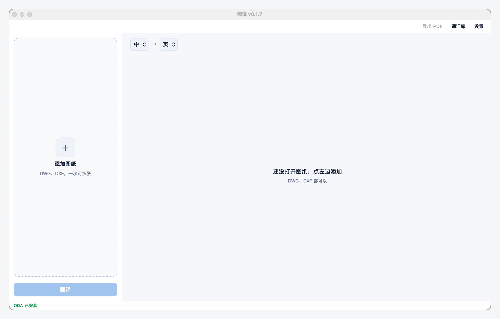
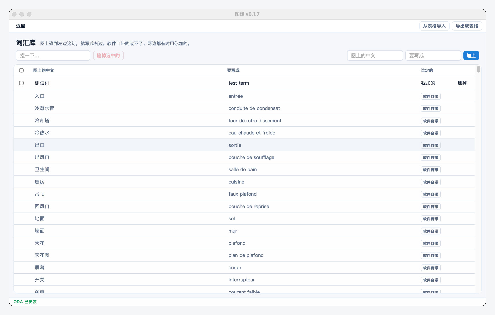
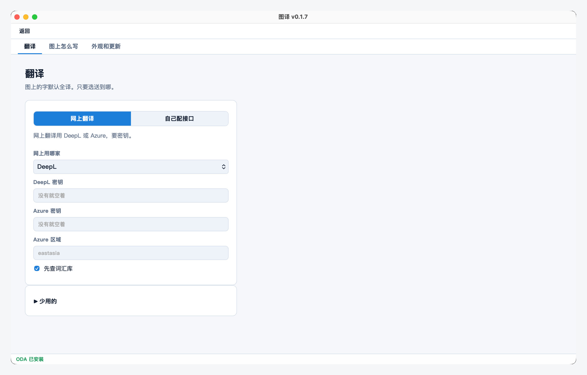
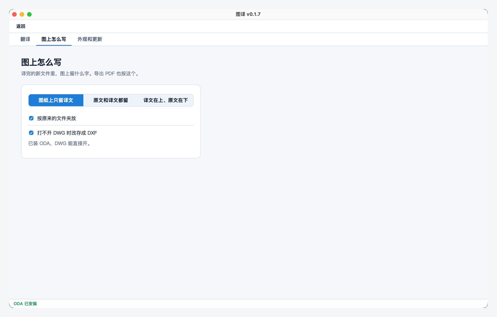
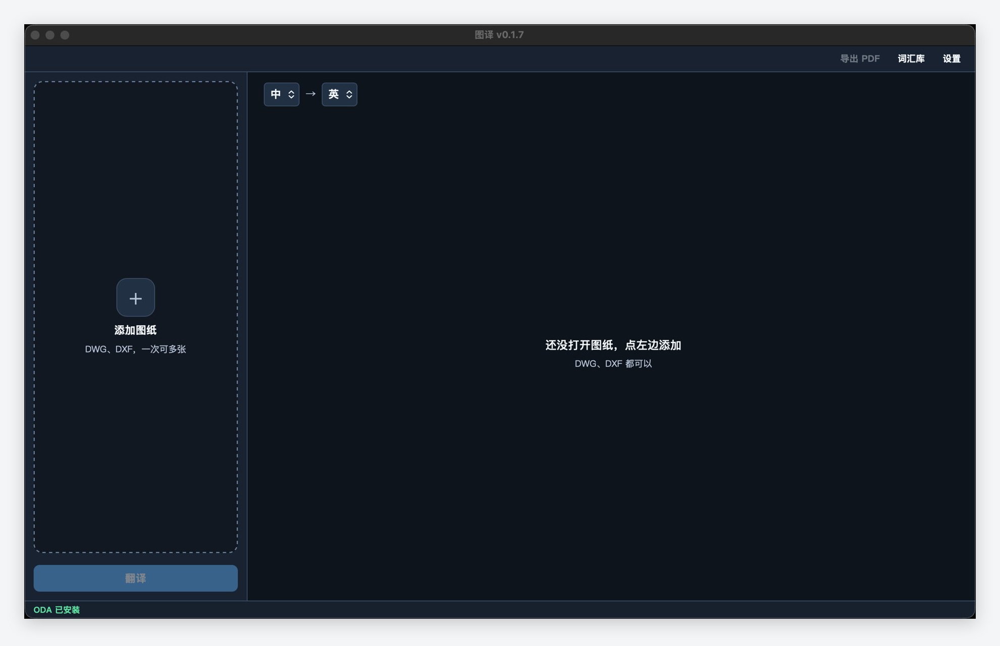

<h4 align="right"><b>English</b> · <a href="README.md">中文</a></h4>

  

<h1 align="center">图译 Tuyi</h1>
<h3 align="center">A powerful, open-source DWG/DXF translator</h3>

  
  
  
  

  <a href="https://erict16.github.io/tuyi/en.html">Website</a>
  ·
  <a href="https://github.com/erict16/tuyi/releases/latest">Download</a>

Open a DWG or DXF. Translate the text. Get a new file. The original stays put. No AutoCAD. Windows and Mac.

## Screenshots

  

<table>
  <tr>
    <td align="center" valign="top" width="50%">
      <h3>Glossary</h3>
      
    </td>
    <td align="center" valign="top" width="50%">
      <h3>Settings</h3>
      
    </td>
  </tr>
  <tr>
    <td align="center" valign="top" width="50%">
      <h3>On the drawing</h3>
      
    </td>
    <td align="center" valign="top" width="50%">
      <h3>Dark</h3>
      
    </td>
  </tr>
</table>

## Features

- **Strong:** titles, notes, attributes, dimensions, table text. Translate writes a new drawing
- **Open:** MIT. Your keys stay yours. Tuyi has no accounts
- **Simple:** drop files on the left, translate at the bottom. Engines live in 设置
- **Steady:** glossary hits skip the API. Light / dark. Original files stay read-only

## Install

Get the latest build from [GitHub Releases](https://github.com/erict16/tuyi/releases/latest).

- **Windows 10 / 11 (64-bit):** run `Tuyi_*_Setup.exe`. You can pick the folder. 32-bit is not supported.
- **Mac:** Apple silicon and Intel are **different** DMGs. Drag 图译 into Applications.

The build is not code-signed. First launch will warn you.

- Windows: More info → Run anyway
- Mac: right-click → Open. Or System Settings → Privacy & Security → Open Anyway

DXF works out of the box. DWG needs [ODA File Converter](https://www.opendesign.com/guestfiles/oda_file_converter) on the same computer. Tuyi cannot ship ODA.

## How to use it

1. Click **添加图纸** or drop a `.dwg` / `.dxf` on the left.
2. Pick Chinese → English (or another pair).
3. Click **翻译**. Tuyi writes a new file.
4. Keys and layout live in **设置**. Your word list is **词汇库**.

## License

MIT. If it helps, star the repo.
