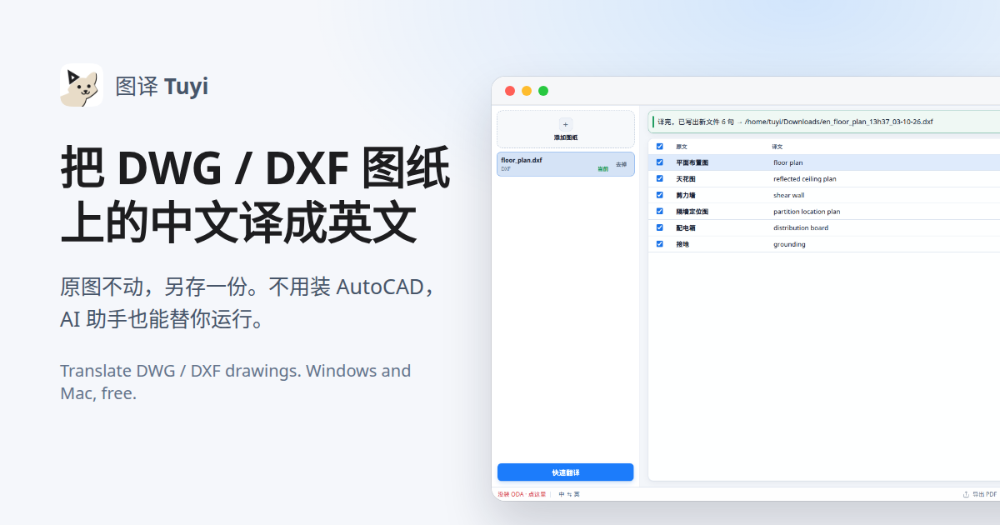
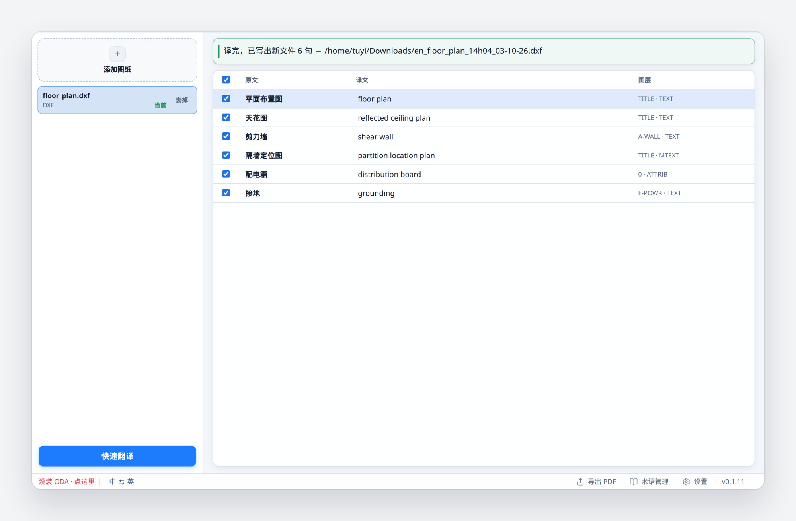

<h4 align="right"><a href="README.md">中文</a> · <a href="README.en.md">English</a> · <a href="README.ja.md">日本語</a> · <a href="README.ko.md">한국어</a> · <b>Español</b></h4>

<p align="center">
  <a href="https://erict16.github.io/tuyi/en.html"></a>
</p>

<h1 align="center">图译 Tuyi</h1>
<h3 align="center">Traduce al inglés el chino de tus planos DWG / DXF</h3>

<p align="center">
  <a href="https://github.com/erict16/tuyi/releases/latest"></a>
  
  
</p>

Tuyi abre un plano DWG o DXF, traduce el texto, lo vuelve a escribir en el plano y guarda un archivo nuevo. El original no se toca y no hace falta AutoCAD. Traduce cajetines, notas, atributos de bloque, cotas y tablas.

## Descarga (v0.1.11, gratis)

- **Windows 10 / 11 (64 bits):** [Tuyi_v0.1.11_Setup.exe](https://github.com/erict16/tuyi/releases/download/v0.1.11/Tuyi_v0.1.11_Setup.exe)
- **Mac con Apple Silicon (M1 a M4):** [Tuyi_v0.1.11_macOS_arm64.dmg](https://github.com/erict16/tuyi/releases/download/v0.1.11/Tuyi_v0.1.11_macOS_arm64.dmg)
- **Mac con Intel:** [Tuyi_v0.1.11_macOS_x86_64.dmg](https://github.com/erict16/tuyi/releases/download/v0.1.11/Tuyi_v0.1.11_macOS_x86_64.dmg)

¿No sabes qué Mac tienes? Míralo en Acerca de este Mac, en el menú Apple. Las versiones nuevas salen en [Releases](https://github.com/erict16/tuyi/releases/latest).

Los instaladores aún no están firmados, así que el sistema los para la primera vez. Es normal. En Windows: Más información → Ejecutar de todas formas. En Mac: abre el DMG, arrastra Tuyi a Aplicaciones y la primera vez haz clic derecho en el icono → Abrir.

DXF funciona nada más instalar. Para DWG instala también [ODA File Converter](https://www.opendesign.com/guestfiles/oda_file_converter), que es gratis.

## Deja que tu asistente de IA lo haga

¿Usas WorkBuddy, ChatGPT o Claude? Pueden ejecutar Tuyi por ti, sin que tengas que hacer clic. Mándale esta frase:

> Tengo Tuyi instalado en mi ordenador. Úsalo para traducir al inglés los DWG / DXF de mi carpeta Planos, guárdalos como archivos nuevos y no cambies los originales.

El asistente tiene que poder ejecutar programas en tu ordenador. Normalmente es la app de escritorio, y te pedirá permiso antes.

## Así se ve

<p align="center">
  
</p>

## Cómo se usa

Por ahora la app está en chino. Los nombres de los botones van entre paréntesis.

1. Pulsa Añadir planos (添加图纸) a la izquierda o suelta ahí archivos `.dwg` / `.dxf`. Puedes añadir varios.
2. Elige el sentido abajo a la izquierda. Por defecto es chino → inglés.
3. Pulsa Traducción rápida (快速翻译). El archivo nuevo va a Descargas.
4. Tus términos van en Glosario (术语管理). Las claves de traducción están en Ajustes (设置).

Los términos que coinciden con el glosario se usan tal cual, sin conexión. El resto lo traduce el servicio que pongas en Ajustes: DeepL, Azure, una API compatible con OpenAI u Ollama en tu propio equipo. No hay registro y no se recogen datos.

## Para desarrolladores

```bash
python -m tuyi translate drawing.dxf --output-dir out --mode zh_to_en
```

En una copia instalada, en Windows es `tuyi-cli.exe` junto a `Tuyi.exe` y en Mac `Tuyi.app/Contents/MacOS/tuyi-cli`. La lista de opciones está en [README.en.md](README.en.md#command-line-let-your-ai-assistant-translate-the-drawings) y el entorno de desarrollo en [CONTRIBUTING.md](CONTRIBUTING.md).

## Licencia

[MIT](LICENSE). Empezó como fork de [etianwang/CAD_translator](https://github.com/etianwang/CAD_translator).
