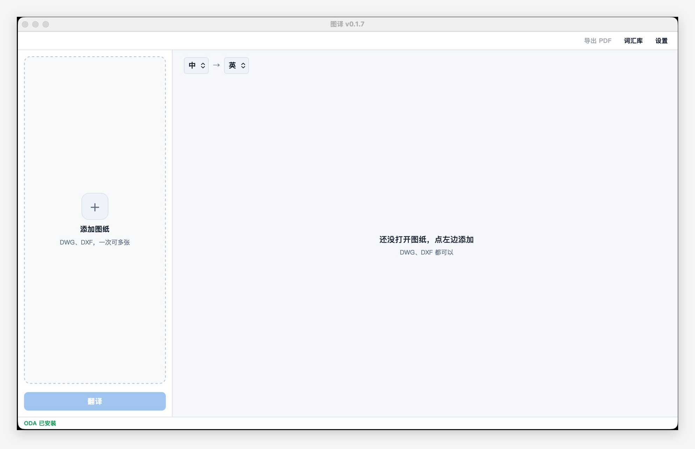

<p align="center">
  
</p>

<h1 align="center">图译 Tuyi - DWG / DXF 도면 번역</h1>

<p align="center">
  <a href="README.en.md">English</a> ·
  <a href="README.md">中文</a> ·
  <a href="README.ja.md">日本語</a> ·
  <b>한국어</b> ·
  <a href="README.es.md">Español</a>
</p>

<p align="center">
  <a href="https://github.com/erict16/tuyi/releases"></a>
  
  
  
</p>

<p align="center">
  
</p>

Tuyi는 **Windows**와 **macOS**용 데스크톱 앱입니다. CAD 도면을 열면 도면 위 글자가 표로 나옵니다. 번역한 뒤 돌려쓰면 **새** 도면이 생깁니다. 원본 파일은 그대로 둡니다.

AutoCAD는 필요 없습니다.

해외 고객에게 도면을 넘길 때, 또는 영어 도면을 중국어로 바꿀 때 씁니다. 도면 이름, 주석, 속성, 치수, 표 안의 글자가 대상입니다. 기본은 중국어 → 영어입니다. 방향은 바꿀 수 있습니다.

## 설치

[Releases](https://github.com/erict16/tuyi/releases)에서 받습니다.

- **Windows:** 10 또는 11, 64비트. Setup exe를 실행합니다. 32비트는 안 됩니다.
- **Mac:** Apple 실리콘(M1 이후)이 하나의 DMG입니다. Intel Mac은 다른 파일입니다. 같은 설치 파일이 아닙니다. 열어서 图译을 Applications로 드래그하세요.

지금 설치 파일은 코드 서명이 없습니다. 처음 열면 운영체제가 막습니다. 정상입니다.

- **Windows:** 추가 정보 → 실행.
- **Mac:** 앱을 우클릭한 다음 열기. 또는 시스템 설정 → 개인 정보 보호 및 보안 → 확인 후 열기.

## 쓰는 법

1. `.dwg` 또는 `.dxf`를 엽니다.
2. 번역을 누릅니다. 원문 | 번역 | 레이어 표가 나옵니다.
3. 틀린 줄은 그 자리에서 고칩니다.
4. 돌려씁니다. 새 파일은 `문서/Tuyi output` (영어 환경은 `Documents/Tuyi output`)에 저장됩니다.

폴더 단위로 한꺼번에 내보낼 수도 있습니다.

## DWG는 프로그램이 하나 더 필요합니다

**DXF:** 열고 번역하면 됩니다. 다른 프로그램은 필요 없습니다.

**DWG:** 같은 컴퓨터에 먼저 [ODA File Converter](https://www.opendesign.com/guestfiles/oda_file_converter)를 설치하세요. Tuyi는 PATH에서 찾습니다. `CAD_ODA_EXEC`로 위치를 지정해도 됩니다. ODA를 Tuyi 설치 파일에 넣을 수는 없습니다. 그쪽 라이선스가 막습니다.

## 번역은 누가 하나

Tuyi 자체 클라우드 계정은 없습니다. 아래 중 하나를 직접 넣습니다.

- 가지고 있는 용어집 (딱 맞는 단어는 API로 안 보냄)
- [Azure Translator](https://azure.microsoft.com/products/ai-services/ai-translator)
- [DeepL](https://www.deepl.com)
- 이 컴퓨터의 [Ollama](https://ollama.com)
- 직접 돌리는 OpenAI 호환 API

키는 이 컴퓨터에만 남습니다. Tuyi는 밖으로 사용 기록을 보내지 않습니다. 공짜입니다 (MIT).

## 명령줄

창에서 하는 일과 같습니다.

```bash
python -m tuyi translate drawing.dxf
python -m tuyi translate drawing.dwg -o out.dwg --mode zh_to_en
```

Windows에서는 `Tuyi.exe` 옆에 `tuyi-cli.exe`가 있습니다.

## 소스에서 실행

개발과 테스트는 [CONTRIBUTING.md](CONTRIBUTING.md)에 있습니다. PR을 환영합니다. `main`에 들어가기 전에 Eric이 봅니다.

## 라이선스

MIT. [etianwang/CAD_translator](https://github.com/etianwang/CAD_translator)의 포크입니다.
