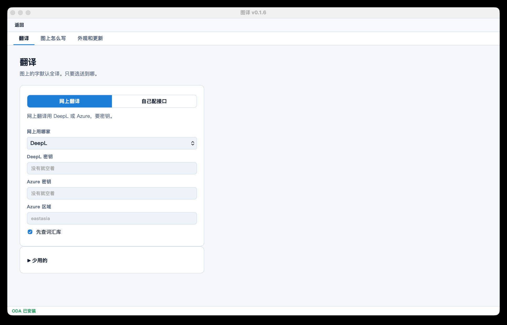

<p align="center">
  
</p>

<h1 align="center">图译 Tuyi</h1>

<p align="center">Open a DWG or DXF. Translate the text. Get a new file. Original stays put.</p>

<p align="center">
  <b>English</b> ·
  <a href="README.zh-CN.md">简体中文</a>
</p>

<p align="center">
  <a href="https://github.com/erict16/tuyi/releases"></a>
  
  
  
</p>

<p align="center">
  
</p>

Tuyi is a desktop app for **Windows 10/11 (64-bit)** and **macOS** (Apple silicon and Intel). You drop in a CAD drawing, it lists the text, you hit **翻译**, and it writes a **new** drawing. The original file is not changed.

You do not need AutoCAD.

## Install

Download from [Releases](https://github.com/erict16/tuyi/releases). Site: the landing page on this repo.

- **Windows:** run `Tuyi_*_Setup.exe`. You can pick the folder. 32-bit is not supported.
- **Mac:** Apple silicon and Intel are **different** DMGs. Open the DMG and drag 图译 into Applications.

The build is not code-signed. First launch will warn you. That is expected.

- **Windows:** More info → Run anyway.
- **Mac:** right-click → Open. Or System Settings → Privacy & Security → Open Anyway.

## How to use it

1. Click **添加图纸** or drop a `.dwg` / `.dxf` on the left. Several files at once is fine.
2. Pick Chinese → English (or another pair) at the top.
3. Click **翻译**. Tuyi writes a new file. You can edit a row first if you want.
4. Keys and “only translation vs both” live in **设置**. Your word list is **词汇库**.

<p align="center">
  
</p>

## DWG

**DXF** works out of the box.

**DWG** needs [ODA File Converter](https://www.opendesign.com/guestfiles/oda_file_converter) on the same computer. Tuyi looks on PATH, or you set `CAD_ODA_EXEC`. We cannot ship ODA. Their licence does not allow it.

## Who translates

Tuyi has no cloud account of its own. In **设置** you pick:

- **网上翻译** — DeepL or Azure (your key)
- **自己配接口** — an OpenAI-compatible URL
- **不联网** — Ollama on this machine (under 少用的)

Exact hits in **词汇库** skip the API. The key stays on disk. Tuyi does not phone home. MIT licence.

<p align="center">
  
</p>

## Command line

```bash
python -m tuyi translate drawing.dxf
python -m tuyi translate drawing.dwg -o out.dwg --mode zh_to_en
```

A Windows install also has `tuyi-cli.exe` next to `Tuyi.exe`. `python -m dwglot` still works.
