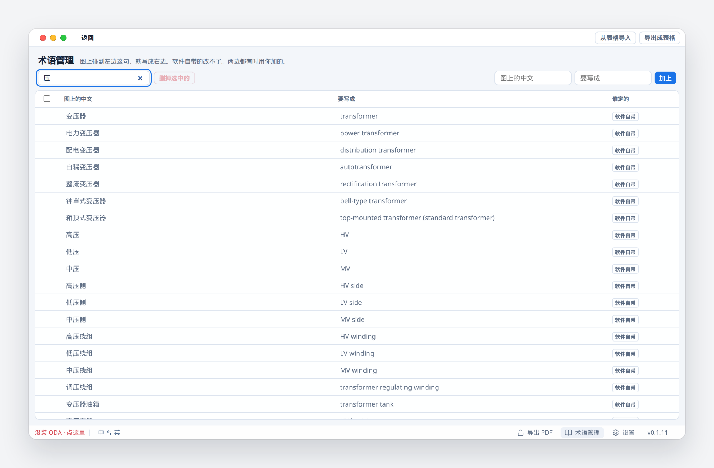
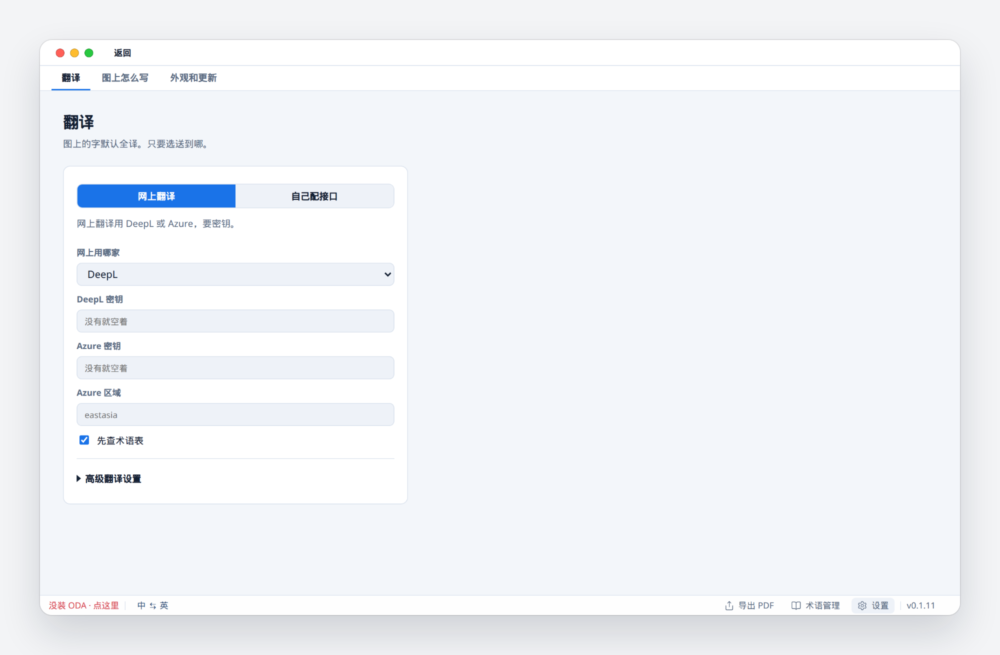
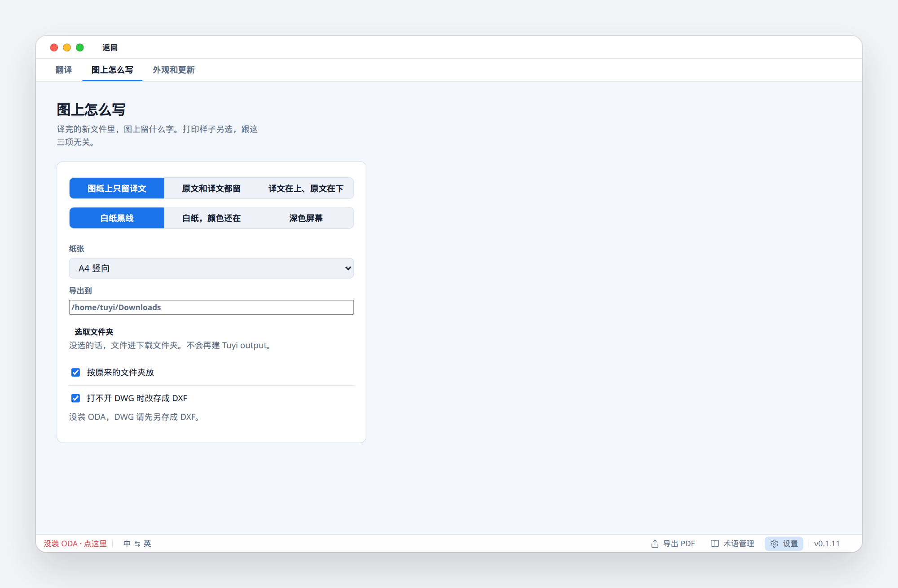
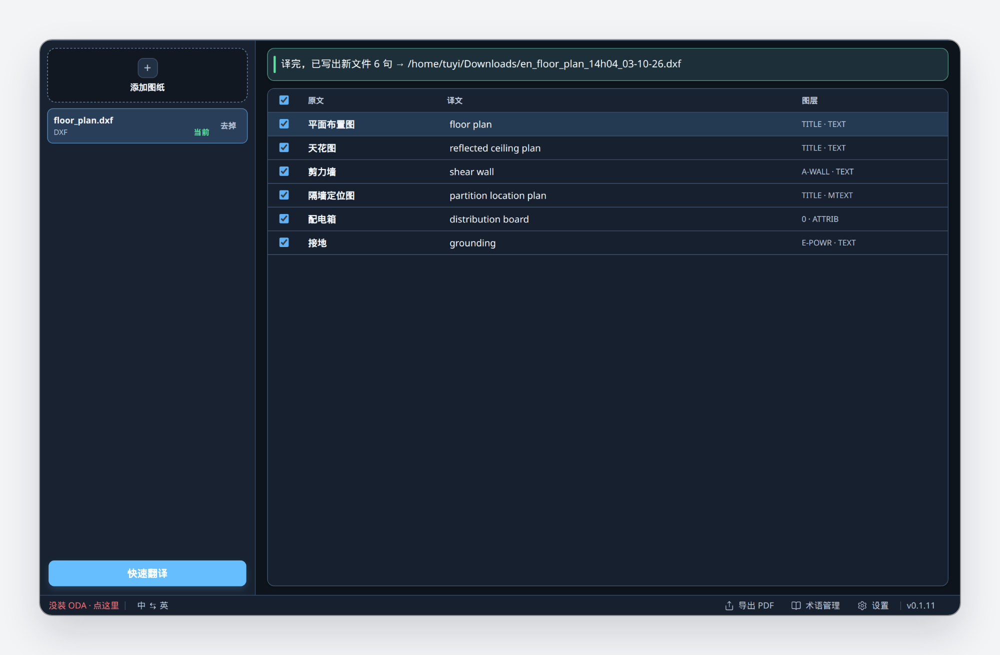

<h4 align="right"><a href="README.en.md">English</a> · <b>中文</b></h4>

<p align="center">
  
</p>

<h1 align="center">图译 Tuyi</h1>
<h3 align="center">强大且开源的 DWG/DXF 翻译工具</h3>

<p align="center">
  <a href="https://github.com/erict16/tuyi/releases"></a>
  
  
  
</p>

<p align="center">
  <a href="https://erict16.github.io/tuyi/">官网</a>
  ·
  <a href="https://github.com/erict16/tuyi/releases/latest">下载</a>
</p>

打开 DWG / DXF，译图纸上的字，另存一份新文件。原图不动。不用 AutoCAD。Windows 和 Mac 都能用。

命令行全程不用人点，AI 助手（Claude Code、Cursor、Codex、Grok）或脚本能替你把图纸译完。见下面的「命令行」。

## 界面

<p align="center">
  
</p>

<table>
  <tr>
    <td align="center" valign="top" width="50%">
      <h3>词汇库</h3>
      
    </td>
    <td align="center" valign="top" width="50%">
      <h3>设置</h3>
      
    </td>
  </tr>
  <tr>
    <td align="center" valign="top" width="50%">
      <h3>图上怎么写</h3>
      
    </td>
    <td align="center" valign="top" width="50%">
      <h3>深色</h3>
      
    </td>
  </tr>
</table>

## 特点

- **强**：标题、注释、属性、标注、表格里的字都能译。点翻译就写出新图
- **开**：MIT 开源。密钥用你自己的，图译不建账号、不回传
- **简**：左边拖进去，底下点翻译。网上翻译、自己配接口，都在设置里
- **稳**：词汇库对上的词不走接口。浅色 / 深色。原文件只读

## 安装

从 [GitHub Releases](https://github.com/erict16/tuyi/releases/latest) 下载最新安装包。

1. **Windows 10 / 11（64 位）**：跑 `Tuyi_*_Setup.exe`，文件夹可以自己选。32 位不行。
2. **Mac**：Apple 芯片和 Intel **不是**同一个 DMG。打开后把「图译」拖进应用程序。

安装包还没买代码签名，第一次打开系统会拦，这是正常的。

- Windows：更多信息 → 仍要运行
- Mac：右键 → 打开。或 系统设置 → 隐私与安全性 → 仍要打开

只译 DXF，装上就能用。要译 DWG，本机自己装 [ODA File Converter](https://www.opendesign.com/guestfiles/oda_file_converter)。图译不把它打进安装包。

## 怎么用

1. 点左边 **添加图纸**，或把 `.dwg` / `.dxf` 拖进去。一次可以多张
2. 上面选中 → 英（或别的方向）
3. 点 **翻译**。会写出新文件。某一行不对，可以先改
4. 密钥、「图上只留译文还是都留」在 **设置**。自己的词在 **词汇库**

## 谁来译

图译自己没有网号。在设置里选：

- **网上翻译**：DeepL 或 Azure（用你的密钥）
- **自己配接口**：兼容 OpenAI 的网址
- **不联网**：本机 Ollama（在「高级翻译设置」里）

## 命令行：让 AI 助手替你翻译图纸

命令行全程不用人点：不弹窗、不提问，跑完自己退出。所以 Claude Code、Cursor、Codex、Grok 这类能跑终端命令的 AI 助手，或者你自己的脚本，都能从头到尾把图纸译完。

```bash
python -m tuyi translate drawing.dxf
```

你对助手说「把 drawings 里的图纸都译成英文，再各导出一份 PDF」，它会跑：

```console
$ python -m tuyi translate drawings/floor_plan.dxf drawings/dims_tables.dxf --output-dir out --mode zh_to_en
/home/tuyi/project/out/en_floor_plan_11h37_03-10-26.dxf
extracted: 6
translated: 6
/home/tuyi/project/out/en_dims_tables_11h37_03-10-26.dxf
extracted: 4
translated: 4

$ python -m tuyi pdf out/*.dxf --output-dir out --appearance 黑白
out/en_dims_tables_11h37_03-10-26.pdf
appearance: 黑白
paper: a4
pages: 1
out/en_floor_plan_11h37_03-10-26.pdf
appearance: 黑白
paper: a4
pages: 2
```

（真跑的输出，图纸是 `tests/fixtures` 里的两张。）

- 每张图三行：新文件路径、`extracted` 句数、`translated` 句数。错误写到 stderr，退出码 1；参数不对退出码 2
- 原图不动，总是另存新文件
- 内置词库（中 ⇄ 英、中 ⇄ 法）命中的不联网；其余走设置里存的 DeepL / Azure / Ollama / 自定义接口
- 常用参数：`-o`、`--output-dir`、`--mode zh_to_en`、`--provider`、`--glossary`、`--style`；PDF 有 `--paper`、`--appearance`

把这段贴给助手，或写进项目的 `AGENTS.md` / `CLAUDE.md` / Cursor 规则：

```text
翻译 CAD 图纸用图译命令行（在图译源码目录里运行；Windows 安装版用 tuyi-cli.exe）：
python -m tuyi translate <图纸.dwg 或 .dxf，可以多张> --output-dir <输出文件夹> --mode zh_to_en
成功时每张图打印新文件路径、extracted、translated。失败看 stderr，退出码不是 0。
要 PDF：python -m tuyi pdf <译好的图纸> --output-dir <输出文件夹>
不会覆盖原图。不确定参数先跑 python -m tuyi translate --help。
```

`python -m tuyi` 在源码目录里跑。Windows 安装目录里，`tuyi-cli.exe` 在 `Tuyi.exe` 旁边；Mac 在 `Tuyi.app/Contents/MacOS/tuyi-cli`。DWG 一样要本机装 ODA。`python -m tuyi --help` 看全部参数。

## 协议

MIT。请自由地使用和参与开源。好用的话点一下右上角 Star。
